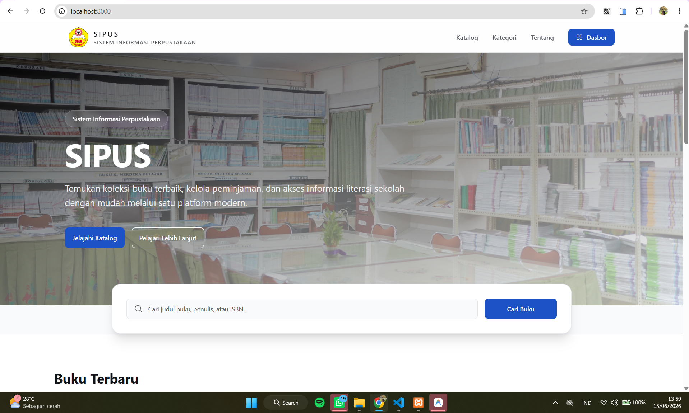
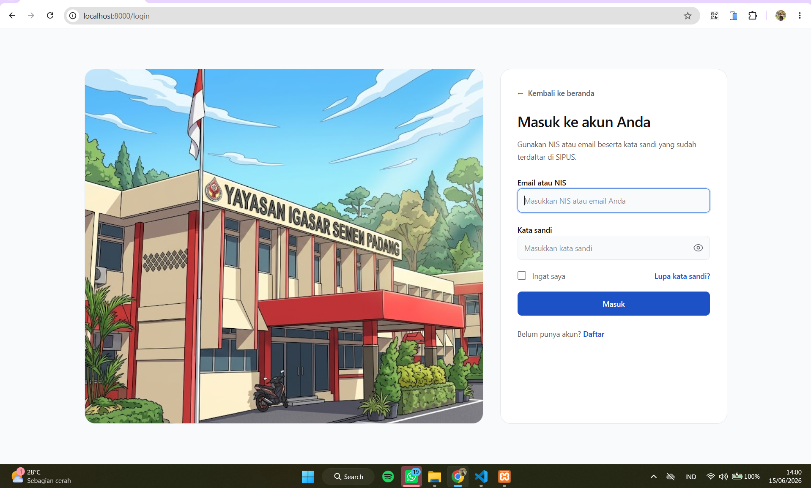
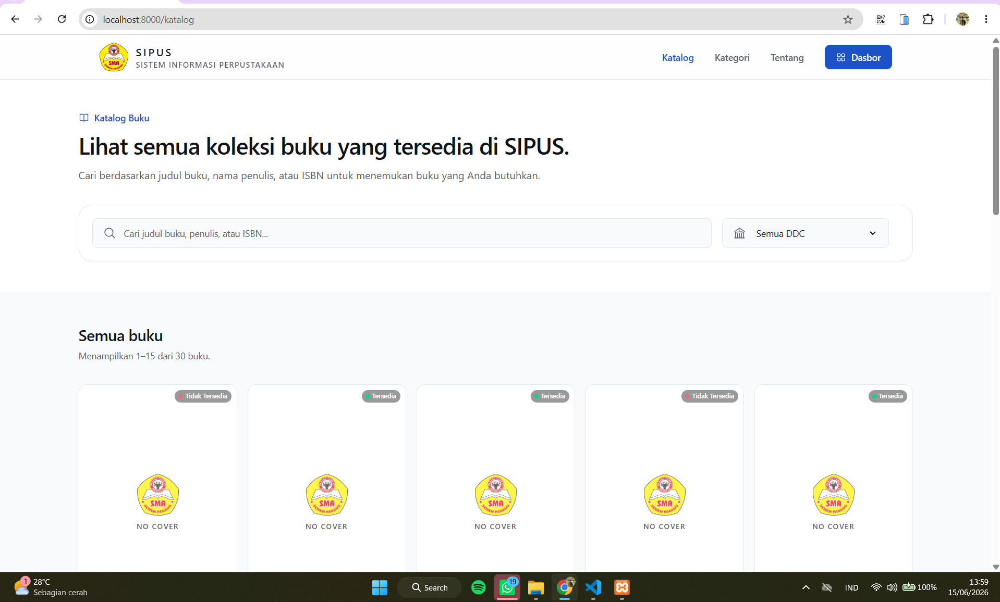
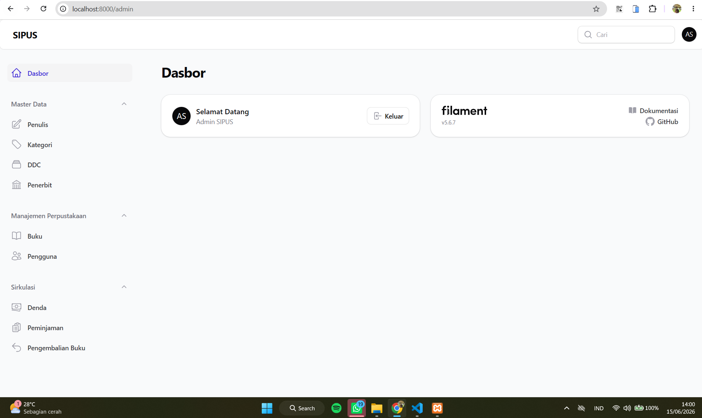

<p align="center">
  
</p>

<h1 align="center">SIPUS</h1>

<p align="center">
  <strong>Sistem Informasi Perpustakaan SMA Semen Padang</strong>
</p>

<p align="center">
  <a href="https://github.com/AnggaaIs/sipus/actions/workflows/ci.yml">
    
  </a>
</p>

## Deskripsi Proyek

SIPUS adalah aplikasi berbasis web yang membantu digitalisasi layanan
perpustakaan SMA Semen Padang. Aplikasi ini menyediakan katalog buku yang
dapat diakses oleh pengguna serta panel administrasi untuk mengelola koleksi,
kategori, peminjaman, pengembalian, dan denda secara terpusat.

SIPUS dikembangkan untuk mempermudah pencarian buku, meningkatkan efisiensi
pengelolaan data perpustakaan, dan mendukung budaya literasi di lingkungan
sekolah.

Target pengguna SIPUS adalah petugas/admin perpustakaan, siswa SMA Semen
Padang, dan pengunjung yang ingin melihat katalog buku.

## Fitur Utama

- Beranda yang menampilkan koleksi buku terbaru.
- Katalog buku dengan pencarian berdasarkan judul, penulis, ISBN, dan DDC.
- Halaman daftar kategori untuk memudahkan eksplorasi koleksi berdasarkan subjek.
- Filter koleksi berdasarkan klasifikasi DDC.
- Informasi ketersediaan dan jumlah eksemplar buku.
- Login menggunakan email atau NISN dan registrasi akun dengan persetujuan admin.
- Pemisahan akses panel admin dan panel user.
- Panel administrasi berbasis Filament dengan mode SPA.
- CRUD buku, kategori, DDC, penulis, penerbit, pengguna, peminjaman, pengembalian, dan denda.
- Pengelolaan denda keterlambatan.
- Manajemen persetujuan akun pengguna.
- Authorization menggunakan Laravel Model Policy.
- Halaman error 404 kustom yang ramah pengguna.
- Antarmuka responsif untuk perangkat desktop dan mobile.

## Teknologi yang Digunakan

| Teknologi      | Kegunaan                            |
| -------------- | ----------------------------------- |
| PHP 8.3+       | Bahasa pemrograman backend          |
| Laravel 13     | Framework utama aplikasi            |
| Filament 5     | Panel administrasi                  |
| Livewire 4     | Komponen antarmuka reaktif          |
| Alpine.js 3    | Interaksi ringan pada sisi pengguna |
| Tailwind CSS 4 | Styling antarmuka                   |
| Vite 8         | Build tool aset frontend            |
| MySQL          | Basis data aplikasi                 |
| Pest 4         | Pengujian aplikasi                  |

## Instalasi Singkat

### Prasyarat

Pastikan perangkat sudah memiliki:

- PHP 8.3 atau lebih baru
- Composer
- Node.js dan npm
- MySQL

### Langkah Instalasi

1. Clone repositori dan masuk ke direktori proyek.

    ```bash
    git clone https://github.com/AnggaaIs/sipus.git
    cd sipus
    ```

2. Instal dependensi backend dan frontend.

    ```bash
    composer install
    npm install
    ```

3. Salin berkas konfigurasi lingkungan dan buat application key.

    ```bash
    cp .env.example .env
    php artisan key:generate
    ```

4. Buat database MySQL bernama `sipus`, kemudian sesuaikan konfigurasi
   database pada berkas `.env`.

    ```env
    DB_CONNECTION=mysql
    DB_HOST=127.0.0.1
    DB_PORT=3306
    DB_DATABASE=sipus
    DB_USERNAME=root
    DB_PASSWORD=
    ```

5. Jalankan migrasi dan seeder.

    ```bash
    php artisan migrate --seed
    ```

6. Build aset frontend.

    ```bash
    npm run build
    ```

7. Jalankan aplikasi.

    ```bash
    composer run dev
    ```

Aplikasi dapat dibuka melalui `http://localhost:8000`, sedangkan panel admin
tersedia di `http://localhost:8000/admin` dan panel user di
`http://localhost:8000/user`.

### Akun Pengembangan

| Role  | Email                | Password   |
| ----- | -------------------- | ---------- |
| Admin | `admin@sipus.com`    | `password` |
| User  | `john.doe@sipus.com` | `password` |

> Akun di atas berasal dari seeder dan hanya ditujukan untuk lingkungan
> pengembangan. Ganti kredensial sebelum aplikasi digunakan pada lingkungan
> produksi.

## Screenshot Proyek

### Halaman Utama



### Halaman Autentikasi



### Katalog Buku



### Dashboard Admin



## Dokumentasi

| Dokumen                                              | Isi                                                   |
| ---------------------------------------------------- | ----------------------------------------------------- |
| [Panduan instalasi](docs/installation.md)            | Persyaratan, setup, test, dan troubleshooting         |
| [Dokumentasi fitur](docs/features.md)                | Aktor, alur, route, controller, dan screenshot        |
| [Dokumentasi dependency](docs/dependency.md)         | Package, versi, fungsi, dampak, dan risiko            |
| [Dokumentasi refactoring](docs/refactoring.md)       | Masalah, perubahan, alasan, dampak, dan bukti commit  |
| [Dokumentasi GitHub Actions](docs/github-actions.md) | Trigger, tahapan CI, hasil, dan pengembangan lanjutan |
| [Changelog](CHANGELOG.md)                            | Riwayat perubahan dan evolusi proyek                  |

## Menjalankan Verifikasi

```bash
npm run build
php artisan test --compact
```

## Tim Pengembang

| Nama                  | NIM        |
| --------------------- | ---------- |
| Angga Islami Pasya    | 2411081004 |
| Ihza Mahendra         | 2411082009 |
| Inayah Henni El Najla | 2411081010 |
| Alya Dhiya Najla      | 2411081003 |

---

<p align="center">
  Dikembangkan untuk mendukung pengelolaan perpustakaan dan budaya literasi
  di SMA Semen Padang.
</p>
