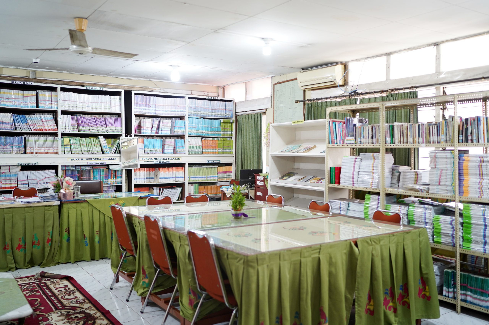
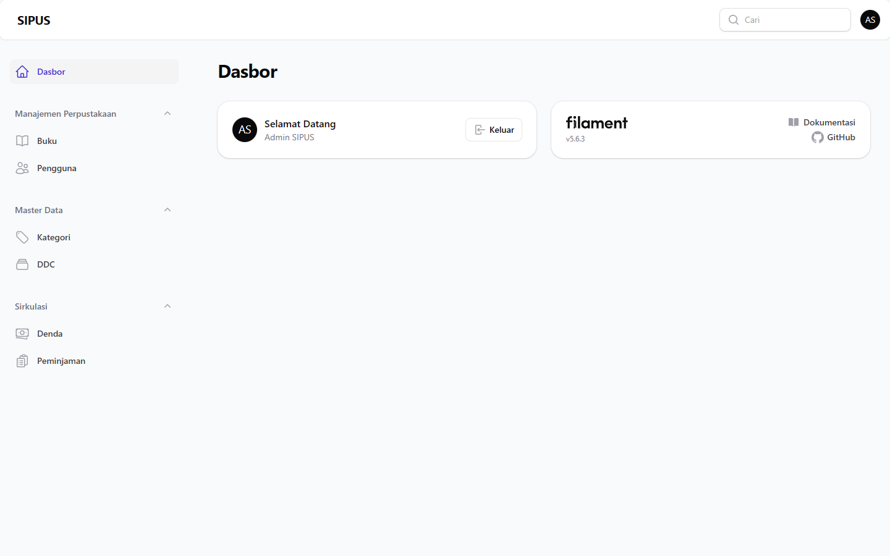
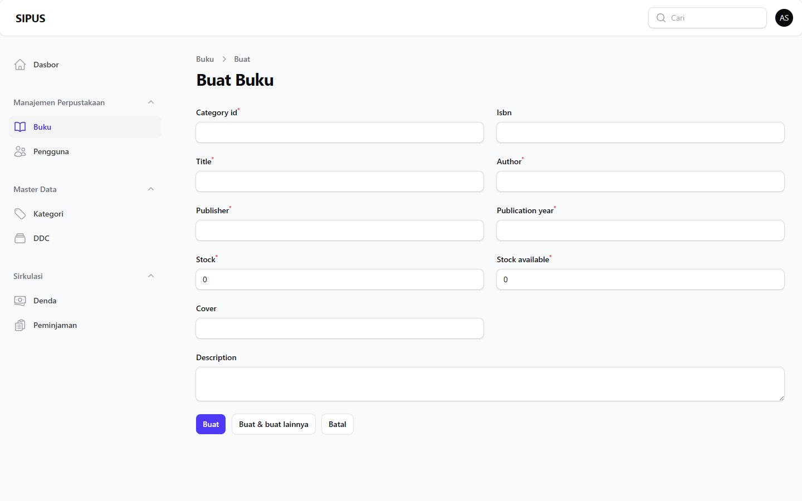

# Dokumentasi Fitur SIPUS

SIPUS melayani dua aktor utama: admin perpustakaan dan pengguna/siswa. Akses
panel dibatasi melalui role, status akun, dan model policy.

## Landing Page

**Tujuan:** Menampilkan identitas perpustakaan, koleksi terbaru, dan koleksi
yang sering dipinjam.

**Aktor:** Pengunjung umum.

**Alur:** Pengunjung membuka beranda, sistem mengambil koleksi terbaru dan
data popularitas peminjaman, lalu menampilkan kartu buku.

**Route dan kode terkait:**

- `GET /`
- `HomeController`
- `resources/views/welcome.blade.php`

## Katalog Buku

**Tujuan:** Memudahkan pencarian koleksi sebelum pengguna datang ke
perpustakaan.

**Aktor:** Pengunjung umum.

**Alur:** Pengunjung memasukkan judul, ISBN, penulis, atau DDC; Livewire
memperbarui query dan menampilkan hasil dengan pagination.

**Route dan kode terkait:**

- `GET /katalog`
- `BookCatalog`
- `resources/views/livewire/book-catalog.blade.php`

Filter yang tersedia:

- Kata kunci judul.
- ISBN.
- Nama penulis.
- Kode atau nama klasifikasi DDC.

## Detail Buku

**Tujuan:** Menampilkan metadata dan ketersediaan sebuah buku.

**Aktor:** Pengunjung umum.

**Alur:** Pengunjung memilih buku dari katalog, sistem melakukan route model
binding, lalu menampilkan detail buku.

**Route dan kode terkait:**

- `GET /buku/{book}`
- `BookController@show`
- `resources/views/books/show.blade.php`

## Login

**Tujuan:** Mengautentikasi admin dan pengguna dengan satu halaman login.

**Aktor:** Admin dan user aktif.

**Alur:** Pengguna memasukkan email/NISN dan password, sistem memvalidasi
status akun, melakukan rate limiting, membuat session, lalu mengarahkan:

- role `admin` ke `/admin`;
- role `user` ke `/user`.

**Route dan kode terkait:**

- `GET /login`
- `POST /login`
- `AuthenticatedSessionController`
- `LoginRequest`

## Registrasi Pengguna

**Tujuan:** Memungkinkan siswa mendaftarkan akun.

**Aktor:** Pengunjung yang belum memiliki akun.

**Alur:** Siswa mengisi nama lengkap, NISN, email, kelas, telepon, dan
password. Akun dibuat dengan role `user` serta status `pending` sampai
disetujui admin.

**Route dan kode terkait:**

- `GET /register`
- `POST /register`
- `RegisterUserController`
- `RegisterRequest`

## Lupa dan Reset Password (Belum Tersedia)

Endpoint lupa dan reset password sudah terdaftar, tetapi implementasi saat
ini masih berupa placeholder. Seluruh aksi mengarahkan pengguna kembali ke
halaman login dengan pesan `Reset password belum tersedia.` Belum ada
pengiriman email, validasi token, maupun penyimpanan password baru.

**Route dan kode placeholder:**

- `GET|POST /forgot-password`
- `GET /reset-password/{token}`
- `POST /reset-password`
- `PasswordResetLinkController`
- `NewPasswordController`

## Panel Admin

**Tujuan:** Menyediakan area operasional perpustakaan.

**Aktor:** Admin aktif dan disetujui.

**Path:** `/admin`

### CRUD Buku

Mengelola identitas buku, ISBN, kategori, DDC, penulis, penerbit, stok, dan
informasi pendukung koleksi.

- Resource: `BookResource`
- Path: `/admin/books`

### CRUD Kategori

Mengelola pengelompokan umum koleksi buku.

- Resource: `CategoryResource`
- Path: `/admin/categories`

### CRUD DDC

Mengelola klasifikasi Dewey Decimal Classification untuk katalog.

- Resource: `DdcResource`
- Path: `/admin/ddcs`

### CRUD Pengguna

Mengelola identitas, role, status persetujuan, kelas, dan status aktif akun.

- Resource: `UserResource`
- Path: `/admin/users`

### CRUD Peminjaman

Mengelola transaksi peminjaman, anggota, tanggal pinjam/jatuh tempo, item
buku, dan status transaksi.

- Resource: `LoanResource`
- Path: `/admin/loans`

### CRUD Denda

Mengelola denda yang terkait dengan transaksi peminjaman.

- Resource: `FineResource`
- Path: `/admin/fines`

## Panel User

**Tujuan:** Menjadi area layanan khusus pengguna.

**Aktor:** User aktif dan disetujui.

**Path:** `/user`

Kondisi saat ini: panel dan dashboard dasar sudah tersedia. Resource layanan
mandiri pengguna belum ditambahkan sehingga pengembangan berikutnya perlu
memasukkan riwayat peminjaman, status denda, dan profil pengguna.

## Authorization dan Policy

Model `User` menerapkan `FilamentUser::canAccessPanel()`:

- Admin hanya dapat membuka panel `admin`.
- User hanya dapat membuka panel `user`.
- Akun pending, rejected, suspended, atau nonaktif ditolak.

Policy tersedia untuk:

- Author
- Book
- Category
- DDC
- Fine
- Loan
- Publisher
- User

Policy melindungi operasi `viewAny`, `view`, `create`, `update`, `delete`,
`restore`, dan `forceDelete` sesuai kebutuhan model.
